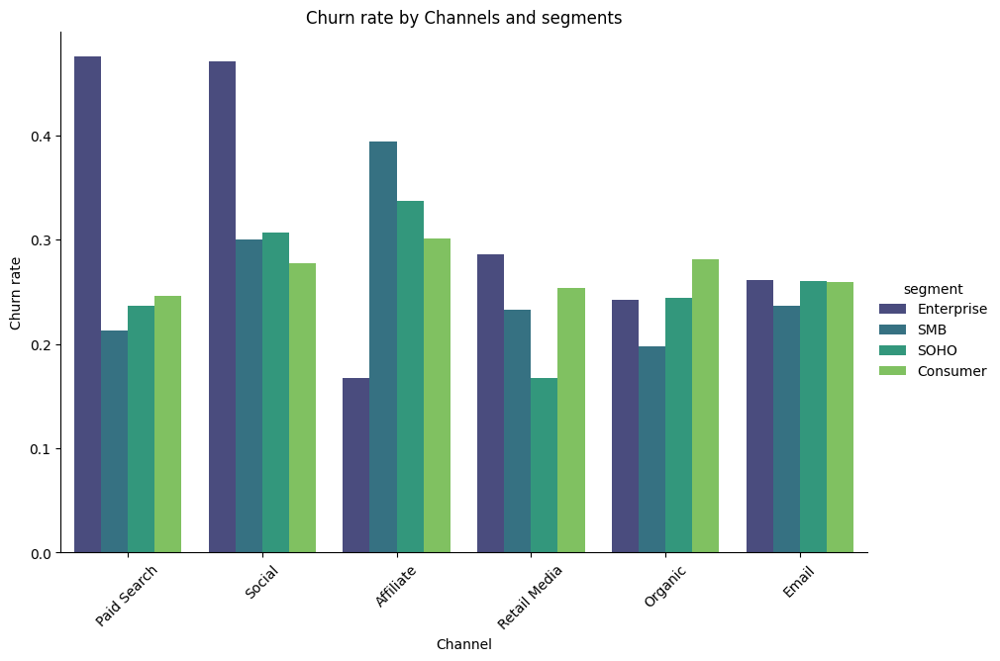
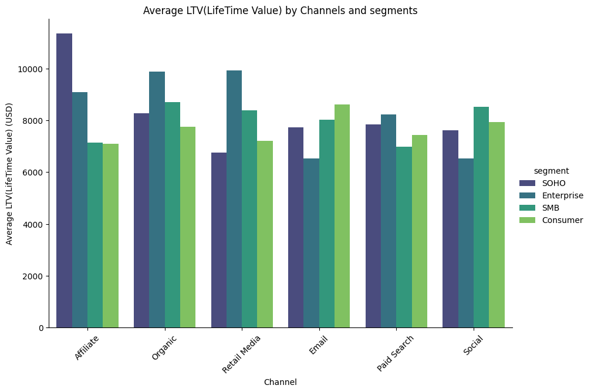
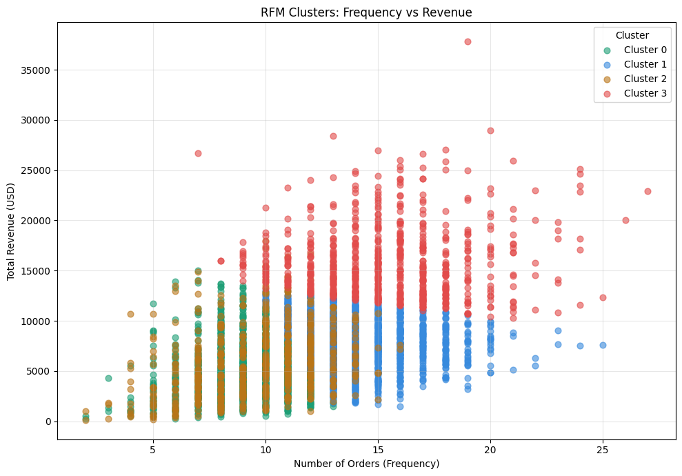
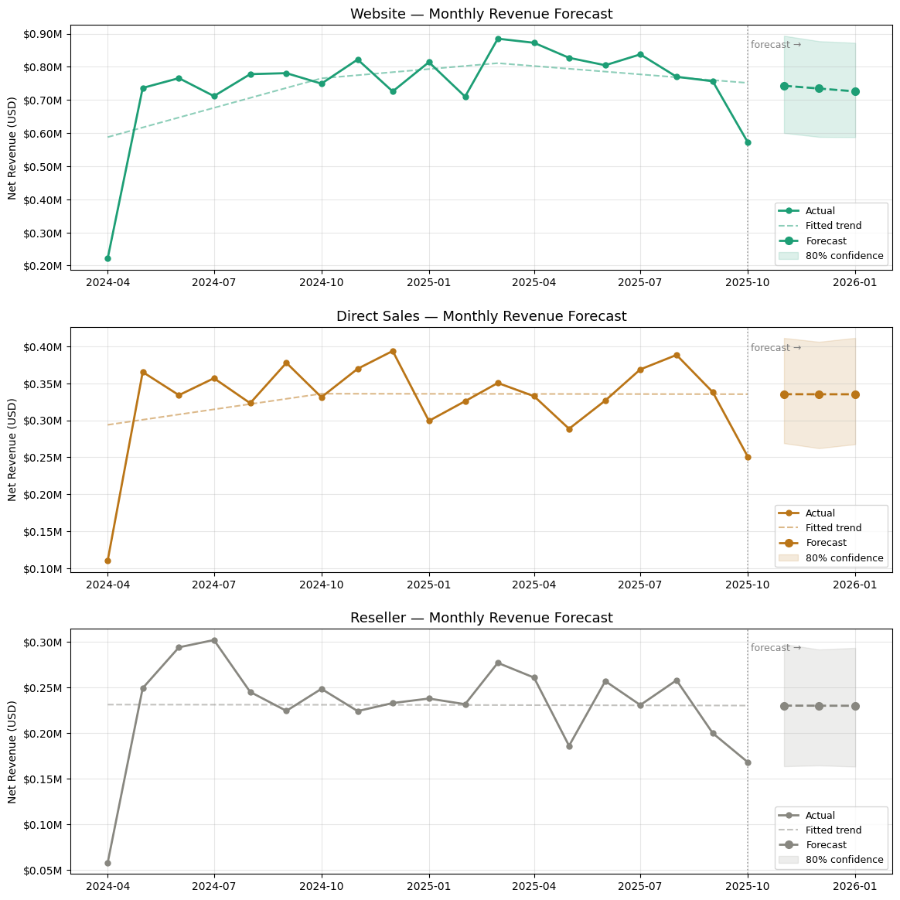

# Revenue Analytics: E-commerce Growth Analysis

**Python · DuckDB · SQL · pandas · scikit-learn · XGBoost · Prophet · seaborn**

This project simulates a real-world revenue analysis for a product/growth analytics role.
47,000+ transactions · 5,000+ customers · April 2024 – October 2025 · 10 countries

B2B/B2C software reseller — Microsoft, Adobe, Salesforce and others.
Annual subscriptions, monthly subscriptions, one-time licenses across Website, Affiliate, Paid Search, Organic, Social, Retail Media, Email.

**Limitations:** the dataset does not include acquisition cost (CAC), so channel efficiency is evaluated on revenue and retention only — not full unit economics.

---

## What this project answers

- Where did revenue stall — and which driver caused it?
- Which channels bring customers worth keeping?
- Where is money leaking silently?
- What should the business prioritize next quarter?

---

## Revenue Overview

$487K (Apr 2024) → $1.69M (May 2024) → **14-month plateau** → $1.20M (Oct 2025).
All three revenue drivers stalled simultaneously after May 2024. This is a structural growth problem, not a seasonal dip.

---

## Revenue Decomposition: Revenue = Users × Orders/User × AOV

| Month | Users | Orders/User | AOV | Revenue |
|---|---|---|---|---|
| Apr 2024 | 680 | 1.10 | $652 | $487K |
| May 2024 | 1,998 | 1.38 | $613 | $1.69M |
| Jun 2024 onward | ~1,950 | ~1.35 | ~$640 | ~$1.72M |

The May jump was driven entirely by 3x user growth — AOV actually fell. Since June 2024 all three drivers are flat. To grow: the business needs to deliberately influence at least one driver to restart growth.

Each driver has a different fix: users → acquisition; orders/user → engagement and lifecycle; AOV → pricing structure and upsell. Without this decomposition, teams apply the wrong fix.

---

## Channel Quality: AOV vs ARPU

| Channel | AOV | ARPU |
|---|---|---|
| Website | $670 | **$3,559** |
| Direct Sales | $650 | $1,703 |
| Marketplace | $690 | $1,169 |
| Partner | $663 | $1,132 |

AOV range across all channels: $42. Channels look identical on AOV — they are not. Website ARPU is 3.1x Partner because Website customers return more often.

**Why ARPU can grow while the business is dying:** if low-ARPU customers churn first and only high-ARPU customers remain, average ARPU rises while total customer count and revenue fall. Always read ARPU alongside customer volume.

---

## Cohort Retention

April 2024 cohort: **695 signups → 352 in Month 1 (50.6%)**. Stabilizes ~50–55% from Month 3.

Customers who survive 60 days tend to stay — the problem is activation, not product.
Improving Month 1 retention from 51% to 65% = ~220 extra retained customers per cohort × $3,559 ARPU = **$783K additional annual revenue per cohort with zero acquisition spend.**

---

## Churn by Channel and Segment

| Channel | Segment | Churn Rate |
|---|---|---|
| Paid Search | Enterprise | **47.6%** |
| Social | Enterprise | **47.1%** |
| Affiliate | Enterprise | **16.7%** |
| Organic | SMB | **19.8%** |

Same segment, same product — 3x difference in churn by channel. Paid Search and Social attract Enterprise customers who were never the right fit.

---

## LTV by Channel and Segment

Top combinations by avg LTV: Affiliate/LATAM/SOHO ($21,451), Organic/LATAM/Enterprise ($18,178), Affiliate/EU/Enterprise ($11,981). Paid Search and Social do not appear in the top 10.

---

## Where We Lose Money

| Problem | Scale | Recoverable? |
|---|---|---|
| Paid Search + Social Enterprise churn 47%+ | High CAC, fast exit | Yes — retarget or cut spend |
| Month 1 retention failure (49% lost) | Largest single growth lever | Yes — onboarding fix |
| Services / UK / Direct Sales refunds | $4,150 direct loss | Yes — fix product listing |
| Support / Philippines / Marketplace refunds | $5,727 direct loss | Yes — fix or remove |
| Adobe Firefly / Canada / Reseller refunds | $5,674 direct loss | Yes — fix or remove |
| Discount program (LTV impact unmeasured) | ~$1.1M lower AOV | Measure before next campaign |

Discounts: 16,614 orders (35% of volume) at avg 10.73% discount, AOV $619 vs $688 full-price. Whether discounted customers renew at the same rate is unknown — if they don't, this is a revenue leak disguised as a sales metric.

---

## RFM Segmentation

KMeans (4 clusters) on Recency, Frequency, Monetary:

| Cluster | Orders | Revenue | Priority |
|---|---|---|---|
| 3 | 10–25 | $15K–$38K | Retain at any cost |
| 0 | 5–10 | $8K–$15K | Keep engaged |
| 2 | 5–10 | $2K–$8K | Monitor for inactivity |
| 1 | 3–18 | up to $11K | Lower engagement |

**XGBoost model** return prediction trained on early customer behavior (frequency, revenue, product breadth in first observation window). Used directionally to identify key drivers of return behavior — not as a deployment-ready churn model.
**ROC AUC: 67.57%**
---

## Time Series Forecast (Prophet)

3-month revenue forecast by top channels. `yearly_seasonality=False` — 18 months of data is insufficient for reliable annual seasonality. `changepoint_prior_scale=0.3` allows the model to follow the plateau without overfitting short-term noise.

Forecast is used as a directional signal to detect structural changes rather than to predict exact revenue values

---

## Business Recommendations

**1. Shift 20–30% of Paid Search budget to Affiliate and Website**
Affiliate Enterprise churn = 16.7% vs 47.6% for Paid Search. Website ARPU = $3,559 vs $1,703.
*Trade-off: Affiliate may not scale as fast as Paid Search — volume may drop short-term while LTV improves.*

**2. Fix Month 1 onboarding before the next acquisition campaign**
695 → 352 in Month 1. Fixing activation before scaling acquisition avoids pouring budget into a leaking funnel.

**3. Audit discounts before the next campaign**
Measure 90-day LTV: discounted vs full-price customers from the last 6 months. If discounted customers churn faster — cap discounts to annual upgrade offers only.
*Trade-off: reducing discounts may hurt short-term order volume before the LTV benefit is visible.*

**4. Fix or remove top-3 refund combinations**
Services/UK ($4,150), Support/Philippines ($5,727), Adobe Firefly/Canada ($5,674). Fix product listing and onboarding. If unfixable in one sprint — pull from that channel.

**5. Proactive retention for Cluster 3**
Renewal outreach 60 days before contract end. In an annual subscription business, the decision to leave is made months before it shows in data.

**6. Track three leading indicators monthly — not total revenue**
Annual subscriptions = 88% of revenue. Problems hide for 6–12 months in the revenue line. Track instead:
renewal-to-new revenue ratio · Month 1 retention rate · Cluster 3 customer count.

---

## Stack

| Tool | Purpose |
|---|---|
| DuckDB + SQL | All aggregations, cohort queries, segmentation |
| pandas | Data cleaning, RFM scoring, cohort matrix |
| Prophet | Monthly revenue forecast by channel, 3-month horizon |
| seaborn / matplotlib | All visualizations |
| scikit-learn KMeans | RFM customer clustering |
| scikit-learn XGBoost | Return behavior driver analysis |

---

*Dataset: DataDNA Dataset Challenge — E-commerce Dataset, November 2025*

---
---

# Revenue Analytics: Аналіз зростання e-commerce

**Python · DuckDB · SQL · pandas · scikit-learn · Prophet · seaborn**

47,000+ транзакцій · 5,000+ клієнтів · квітень 2024 – жовтень 2025 · 10 країн

B2B/B2C реселер ПЗ — Microsoft, Adobe, Salesforce та інші. Річні підписки, місячні підписки, разові ліцензії.

**Обмеження:** датасет не містить вартості залучення (CAC) — ефективність каналів оцінюється за revenue і retention, не за повною unit economics.

---

## Ключові числа

| Метрика | Значення |
|---|---|
| Revenue Apr 2024 → May 2024 | $487K → $1.69M (3.5x за місяць) |
| Плато після травня 2024 | 14 місяців без зростання |
| Website ARPU vs Partner ARPU | $3,559 vs $1,132 (3.1x різниця) |
| Paid Search Enterprise churn | **47.6%** |
| Affiliate Enterprise churn | **16.7%** |
| Month 1 retention | **50.6%** — 49% нових клієнтів йдуть за перший місяць |
| Annual subscriptions | **88% revenue** ($28.1M з $31.8M) |
| Найбільший refund leak | Support/Philippines: $5,727 (15.4% refund rate) |

---

## Revenue = Users × Orders/User × AOV

Стрибок у травні 2024 — виключно за рахунок 3x growth users. AOV впав. З червня всі три драйвери стоять. Без навмисного руху хоча б одного — revenue продовжить стагнувати.

---

## Де губляться гроші

- **Paid Search + Social Enterprise:** churn 47%+ при найвищому CAC
- **Month 1 retention:** 695 → 352. Виправлення з 51% до 65% = $783K додаткового revenue на когорту без витрат на залучення
- **Refunds:** Services/UK $4,150 · Support/Philippines $5,727 · Adobe Firefly/Canada $5,674 — конкретні product-country комбінації, виправляються зміною listing або онбордингу
- **Знижки:** 16,614 замовлень, AOV $619 vs $688, вплив на LTV не виміряний

---

## Бізнес-рекомендації

**1. Перенести 20–30% бюджету з Paid Search → Affiliate і Website**
Affiliate Enterprise churn 16.7% vs 47.6%. Website ARPU $3,559 vs $1,703.
*Trade-off: Affiliate може не масштабуватися так само швидко — обсяг короткостроково впаде.*

**2. Виправити онбординг місяця 1 перед наступною acquisition-кампанією**
Налити більше бюджету в дірявий онбординг = множити втрати.

**3. Виміряти 90-денний LTV дисконтованих клієнтів перед наступною знижковою кампанією**
*Trade-off: скорочення знижок може знизити обсяг замовлень короткостроково.*

**4. Виправити або прибрати топ-3 refund комбінації**
Services/UK, Support/Philippines, Adobe Firefly/Canada. Якщо не виправляється за один спринт — прибрати з каналу.

**5. Проактивне retention для Cluster 3 ($15K–$38K revenue)**
Контакт за 60 днів до кінця контракту. В річній моделі рішення піти приймається задовго до того, як воно видно в даних.

**6. Три leading indicators замість total revenue**
Renewal-to-new ratio · Month 1 retention · Cluster 3 count. Total revenue ховає проблеми на 6–12 місяців в річній subscription моделі.

---

*Dataset: DataDNA Dataset Challenge — E-commerce Dataset, November 2025*
