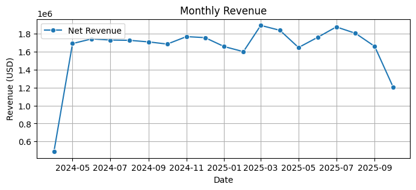
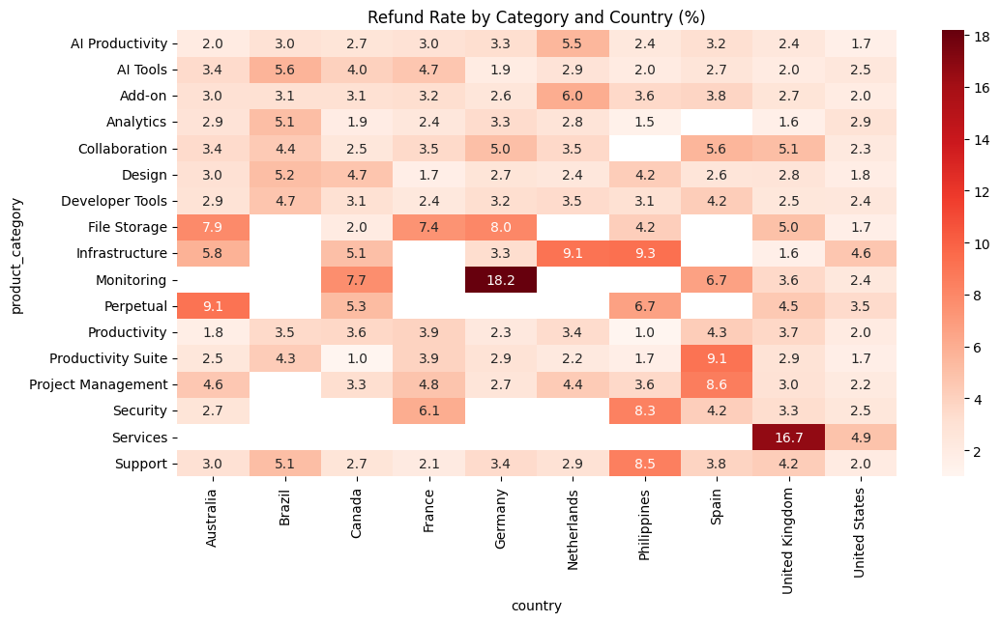
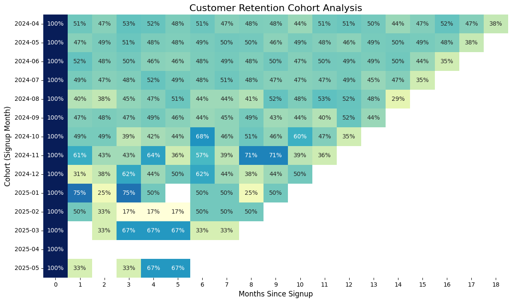

# Revenue Analytics — E-commerce Growth Analysis (UA version below)

**Stack:** Python · DuckDB · pandas · scikit-learn · seaborn · Jupyter  
**Data:** 47,000+ transactions · 5,000+ customers · 18 months · 10 countries  
**Role Focus:** Product Analytics · Growth Analytics · Business Intelligence

---

##  About the Project
This is an end-to-end revenue analysis for a B2B/B2C software reseller (Microsoft, Adobe, Salesforce, etc.) operating across 5 acquisition channels and 10+ markets. 

The goal was to move beyond descriptive statistics to actionable insights: identifying growth drivers, pinpointing revenue leakage, evaluating customer acquisition efficiency, and defining the next strategic steps for the business.

---
##  Tools & Methods
*   **DuckDB + SQL:** High-performance data aggregation and cohort querying.
*   **pandas:** Data cleaning, cohort matrix construction, and RFM scoring.
*   **scikit-learn:** KMeans for customer segmentation and Random Forest for churn/return prediction.
*   **seaborn / matplotlib:** Data visualization and trend analysis.

##  Key Findings

*   **Website Channel Leads ARPU:** 
    *   Website ARPU: **$3,559** vs. Direct Sales: $1,703 | Partner: $1,132.
    *   Since AOV is consistent across channels ($647–$690), the 3x higher ARPU is driven entirely by superior repeat purchase behavior.
*   **The Onboarding Gap:** 49% of new customers do not return after Month 1. Improving retention from 51% to 65% represents a higher revenue opportunity than scaling acquisition.
*   **High-Cost Churn (Paid Search Enterprise):** This segment suffers from a **47.6% churn rate**. It is currently the most expensive to acquire with the worst retention, suggesting a disconnect in targeting or post-sale experience.
*   **Revenue Leakage:** Refund rates of 15–18% are concentrated in specific channel/country clusters (*Monitoring/Germany, Services/UK, Support/Philippines*), indicating localized product-market fit or messaging issues.

## Key Visualizations & Findings

### Monthly Net Revenue

Net revenue grew from $488K in April 2024 to ~$1.75M/month. The plateau after May 2024 signals that user acquisition, order frequency, and AOV stabilized simultaneously.

### Refund Rate by Category and Country

High refund rates (15–18%) in *Monitoring/Germany*, *Services/UK*, and *Support/Philippines* suggest localized product-market fit issues rather than random occurrences.

### 49% of new customers do not return after Month 1. Improving retention from 51% to 65% represents a higher revenue opportunity than scaling acquisition.

##  Analysis Structure (17 Sections)
1. **Revenue Trends:** Net revenue analysis & refund impact.
2. **Growth Drivers:** Decomposition of Revenue = Users × Conversion × AOV.
3. **Retention & Churn:** Cohort analysis & 60-day churn profiling.
4. **Segmentation:** RFM clustering (KMeans) & customer lifetime value (LTV).
5. **Channel Efficiency:** Comparing acquisition cost vs. repeat purchase behavior.
6. **Billing & Discounting:** Impact of subscription cycles and discount program audit.

---

##  Business Recommendations
- [ ] **Shift Budget:** Reallocate spending to the Website channel given its proven repeat behavior.
- [ ] **Fix or Defund:** Stop Paid Search for Enterprise until churn is addressed.
- [ ] **Improve Onboarding:** Focus on the first 60 days to stabilize customer lifecycle.
- [ ] **Localized Audit:** Investigate Services/UK and Support/Philippines to reduce refund losses.
- [ ] **Strategic Monitoring:** Implement a monthly *Renewal-to-New* ratio as a leading indicator for annual contract health.

---
*Dataset: DataDNA Dataset Challenge — E-commerce Dataset, November 2025*
# 📈 Revenue Analytics — E-commerce Growth Analysis

**Stack:** Python · DuckDB · pandas · scikit-learn · seaborn · Jupyter  
**Data:** 47,000+ transactions · 5,000+ customers · 18 months · 10 countries  
**Role Focus:** Product Analytics · Growth Analytics · Business Intelligence

---

## 🔍 Про проект
Це комплексний аналіз доходів для B2B/B2C реселера програмного забезпечення (Microsoft, Adobe, Salesforce та інші), що працює через 5 каналів залучення на 10+ ринках. 

Метою проєкту було не просто описати історичні дані, а відповісти на стратегічні бізнес-питання: де ховається зростання, де компанія втрачає прибуток, які клієнти є найбільш цінними та які кроки необхідно зробити для масштабування.

---

## 📊 Ключові висновки

*   **Website-канал має ARPU в 3 рази вищий за інші:** 
    *   Website ARPU: **$3,559** | Direct Sales: $1,703 | Partner: $1,132.
    *   AOV майже однаковий ($647–$690), отже, різниця криється виключно в повторних покупках.
*   **Критичний відтік нових клієнтів:** 49% клієнтів не повертаються після 1-го місяця. Головний важіль зростання — не агресивний маркетинг, а онбординг.
*   **Проблема Paid Search Enterprise:** Сегмент має найвищий CAC та рекордно високий churn (**47.6%**). Потрібна зміна таргетингу або перегляд процесу постпродажного супроводу.
*   **Локалізовані втрати (Refunds):** Високий рівень рефандів (15–18%) у комбінаціях: *Monitoring/Німеччина, Services/UK, Support/Філіппіни*.

---

## 📈 Структура аналізу
Проєкт складається з 17 розділів, що охоплюють увесь життєвий цикл клієнта:
1. **Revenue Trends:** Динаміка доходів та втрати від рефандів.
2. **Growth Drivers:** Декомпозиція (Users × Conversion × AOV).
3. **Retention & Churn:** Когортний аналіз та 60-денний відтік.
4. **Segment Analysis:** LTV-сегментація та RFM-кластеризація (KMeans).
5. **Subscription Stability:** Аналіз білінг-циклів та вплив знижок.

---

## 🚀 Бізнес-рекомендації
- [ ] **Перерозподіл бюджету:** Збільшити інвестиції у Website-канал.
- [ ] **Оптимізація утримання:** Покращення retention з 51% до 65% дасть максимальний приріст доходу.
- [ ] **Аудит Enterprise:** Призупинити Paid Search для цього сегменту до усунення проблем з churn.
- [ ] **Локалізація:** Переглянути стратегію в UK та на Філіппінах для зменшення refund-втрат.

---

## 🛠 Інструменти та методи
*   **DuckDB + SQL:** Виконання всіх агрегацій та складних вибірок безпосередньо в Python.
*   **pandas:** Очищення даних, побудова когортних матриць, RFM-скоринг.
*   **scikit-learn:** KMeans для сегментації клієнтів, Random Forest для прогнозування повернення.
*   **seaborn/matplotlib:** Візуалізація результатів.

---
*Dataset: DataDNA Dataset Challenge — E-commerce Dataset, November 2025*
